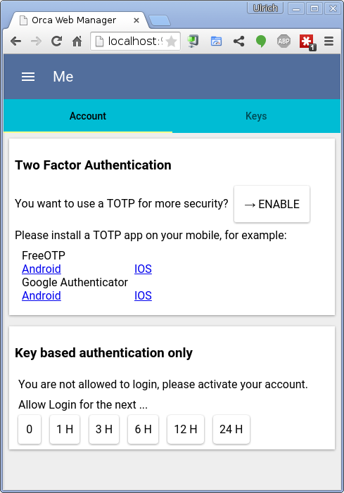
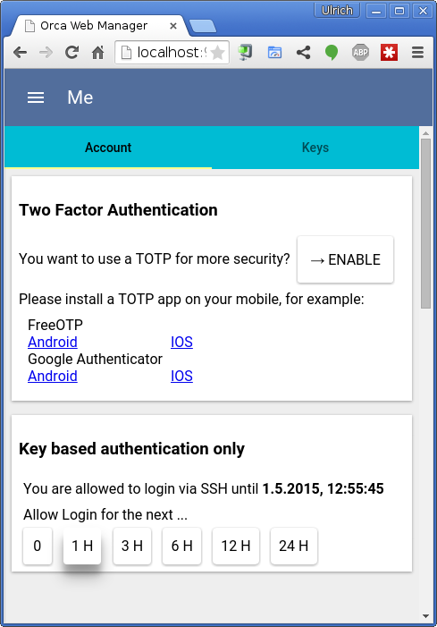
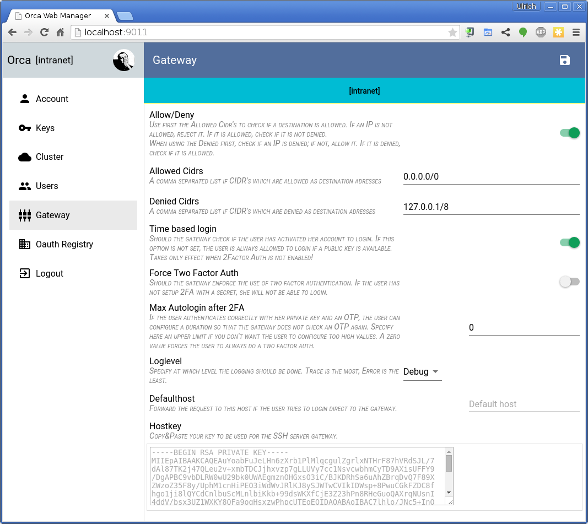
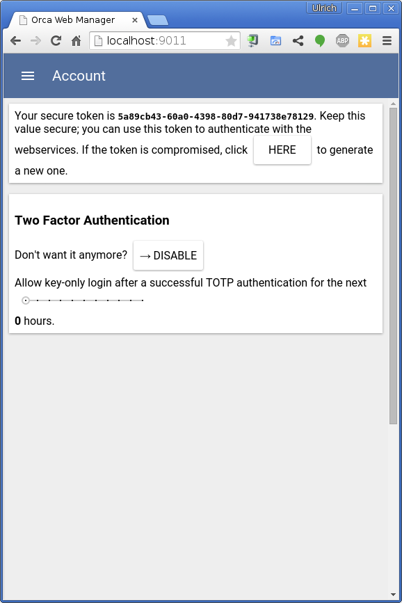

# Orca!
Hi! `orca`is a SSH gateway comparable to a reverse HTTP proxy. You 
can use `orca` to enable your employees to connect to internal servers without 
the need to build a VPN. Simply put `orca` in front of your servers and you can 
connect to any backend server via SSH.


`Orca` uses a public key store to query the user for a given public key. You can 
implement your own REST service (its one single function) or you can use the 
preimplemented key store bundled with `orca` which uses a clustered `etcd` 
backbone to store all the public keys.

## Install/Build

To build `orca` you need `make` `bower` and `go`.

Create a new workspace in your home and execute the included `setup.sh`. You do not
need to clone before, the `setup.sh` clones:
```sh
~ mkdir orcaWorkspace
~ cd orcaWorkspace
~ curl https://raw.githubusercontent.com/clusterit/orca/master/setup.sh | /bin/sh
```

Now you have a `~/orcaWorkspace` directory which should be embedded in your GOPATH. This
workspace contains all needed dependencies. If you don't want a separate project directory
for `orca` you do a `go get github.com/clusterit/orca/cmd/gateway` and the gateway will
be installed in your default GOPATH. The other tools can be built with `make`. 

All binaries are built into `src/github.com/clusterit/orca/packaging/`.

TODO: dockerize the build 


## Usage

Please install [etcd](https://github.com/coreos/etcd) and start a cluster; a
single machine cluster is ok.

If your `etcd` cluster is not accessible via `http://localhost:4001` you can
specify a different location via the `-e ...` flag. You can also name your
zone with `-z myhomezone`.

 In a production you should use an `etcd` cluster with `https` and client
 certificates. You can specifiy the clustermembers with `-e https://<etcd-member>` 
 and also specify the `--etcdkey`, `--etcdcert` (key and cert of the client) and 
 `--etcdca` (the cert of the rootca; not necessarily needed). Another option are the
 environment variables:
  - ORCA_ETCD_MACHINES
  - ORCA_ETCD_KEY
  - ORCA_ETCD_CERT
  - ORCA_ETCD_CA

 If you want a testdrive, start an etcd-cluster with `goreman start` in the testing
 subdirectory. You can then
 ```
 cd testing
 export ORCA_ETCD_MACHINES=https://localhost:4001,https://localhost:4002,https://localhost:4003
 export ORCA_ETCD_KEY=`pwd`/ssl/client.key
 export ORCA_ETCD_CERT=`pwd`/ssl/client.cert
 ```
 
`orcaman` uses an external Oauth provider to authenticate. So first of all, please
register a new application with your github account, navigate to your settings
[and register a new application](https://github.com/settings/applications/new). Enter
*Orca local* as name and *http://localhost:9011* as homepage URL. The redirect
url should be *http://localhost:9011/redirect.html*. Now click on `Update Application`
and you will get a `Client ID` and a `Client Secret`. As the name says, keep the
secret in a secret place :-).

Start `orcaman` and register a oauth provider (at this time, `orca` knows
the settings for *github* and *google*):
```
orcaman provider github <your-clientid> <your-clientsecret>
2015/04/18 16:04:03 [DEBUG] no zones existing, creating zone 'intranet'.
2015/04/18 16:04:06 [DEBUG] create a default gatway setting
2015/04/18 16:04:07 [DEBUG] create a default ManagerConfig setting
(*oauth.OauthRegistration)(0xc208070420)({
 Network: (string) (len=6) "github",
 ClientId: (string) (len=20) "<your-clientid>",
 ClientSecret: (string) (len=40) "<your-clientsecret>",
 Scopes: (string) (len=10) "user:email",
 AuthUrl: (string) (len=40) "https://github.com/login/oauth/authorize",
 AccessTokenUrl: (string) (len=43) "https://github.com/login/oauth/access_token",
 UserinfoUrl: (string) (len=27) "https://api.github.com/user",
 PathId: (string) (len=5) "login",
 PathName: (string) (len=4) "name",
 PathPicture: (string) (len=10) "avatar_url",
 PathCover: (string) ""
})
```
  
Next, register an admin account. Prefix your account with the name of the provider
you used in the previous step:

```
orcaman admins github:<your-github-account>
```

Last, but not least, start `orcaman`:
```
orcaman serve
2015/04/18 16:06:28 [INFO] start listening on :9011
```

Now you can [connect](http://localhost:9011) 


and login with your github account



First, upload a public key, so click on the *Key* tab and add a new key:


In another console you can now start the gateway:
```
gateway
2015/04/18 16:55:07 [INFO] gateway listens on "[::]:2022" ...
```

If you want to connect to a known computer via the gateway, you should first
add your keys to your agent:
```
ssh-add
```
After that you can try to login (please accept the server key; you can change 
it via `orcaman`):
```
ssh -A -p 2022 usc@192.168.0.21@localhost
usc@192.168.0.21@localhost's password:
```
but the gateway denies access and prompts for a password (which will also not be
accepted):

```
2015/04/18 16:55:48 [DEBUG] remote: 127.0.0.1:55746: cannot fetch key for user 'usc@192.168.0.21': HTTP 404: {"error":"entity could not be found"}
2015/04/18 16:55:48 [DEBUG] remote: 127.0.0.1:55746: cannot fetch key for user 'usc@192.168.0.21': HTTP 404: {"error":"entity could not be found"}
2015/04/18 16:55:48 [DEBUG] remote: 127.0.0.1:55746: not allowed to login for user 'usc@192.168.0.21': please activate your account
2015/04/18 16:55:49 [ERROR] failed to handshake (EOF)
```

Here you see three attempts to login, because i have three keys in my local
development computer here (ssh-add'ed). Two of the attepmts  were not accepted because the 
gateway could not find an acceptable user for the provided public key. The third
was denied, because the account is not activated, so lets activate it for 1 hour:



If you now try the login again, it should succeed! 

```
2015/04/18 17:03:23 [INFO] remote: 127.0.0.1:55777: login by &{Id:0e65dc4d-144d-4410-bad2-88f25ae634df Name:ulrichSchreiner Keys:[{Id:usc@fedorabox Value:ssh-rsa .... Fingerprint:... }] Roles:USER,MANAGER Aliases:[ulrichSchreiner@github] Allowance:0xc208114c00}
2015/04/18 17:03:23 [INFO] [client=127.0.0.1:55777] [sid=3f1bee208f674830239f3fbc2fc5ab1164578928ff9cc510fd8d530410a39d58] new ssh connection with [SSH-2.0-OpenSSH_6.6.1p1 Ubuntu-8] 
```

You don't need to use the time based login, go to the *Gateway Settings* and
disable them. You can also change the loglevel and the SSH Server key. Please
note that a change of this values is published to all gateway's in the 
selected zone. You don't have to restart:



As you have seen, the gatway also supports 2FA. To use this feature you need a
OTP app on your mobile. Links to them are embedded in the application. After you
installed such an application, go to your account page and click on *ENABLE*:


After you scanned the QR code you must enter an OTP password displayed on your
OTP application. If you entered the right one you have successfully activated
2FA!



After this activation, you need your private SSH key and you also need your
mobile. The SSH gateway will prompt you for a password and you must enter
the current one time password displayed in your app.

As you can see in the screenshot, there is a caching option. If you don't want
to enter your OTP every time you can use the slider to let the gateway cache 
your successful authentication. Please note that the administrator of the gateway
can overwrite this value with an upper limit! 

## Oauth Providers

To register new OAuth providers, you can use predefined ones (`google`, `github`)
or you can insert the values you want. Here are some templates for given 
oauth servers:

### Gitlab
 - name: `gitlab` 
 - clientid/clientsecret: generate via Gitlab Admin UI
 - scopes: empty
 - Auth Url: `<yourgitlabserver>/oauth/authorize`
 - Access Token Url: `<yourgitlabserver>/oauth/token`
 - Userinfo Url: `<yourgitlabserver>/api/v3/user`
 - Path Id: `username`
 - Path Name: `name`
 - Path Picture: `avatar_url`

## Components
----------
`orca` has the different components, one for the ssh gateway, another for the management
interface/rest services.

### SSH Gateway
This is the SSH daemon that listens for incoming requests. Any request must have one or more 
public keys and the gateway invokes a REST call `UserByKey` to get the user for the given public
key. If there is no such user, the login will be denied.

If there is a user, the gateway checks an optinal *Allowance*. This check can be enforced, so that
the user has to login via a second channel (a web UI) and click on a button to allow the login for
a specific duration. 

After the permission to login to the gateway is granted, the request will be forwarded to the
referenced backend server with current `ssh-agent` provided keys. 

### OrcaMan
The `orcaman` provides Rest-Services and an embedded HTML5 app. This application can be used 
to store keys inside `etcd` and to request an *Allowance* for a specific time. If you have 
the **MANAGER** role you can also register new users and change some other settings. 
The `orcaman` also implements the `UserByKey` REST endpoint
which is needed by the gateway. If you start `orcaman` with a *publish address* it registeres
itself within a wellknown key inside of `etcd` so it will be discoverable by the gateway. After
stopping or crashing `orcaman` it will deregister automatically.

To secure the REST api, `orcaman` uses a *JWT* which signs the user data with a RSA key. The
allowed users for `orcaman` have to be configured in the `etcd` backbone. The user logs in via
an Oauth2 Provider (at this time `orcaman` supports *Google* users, but other OAuth2 providers will
follow soon) and `orcaman` checks if the user is allowed to use `orca`.

`orcaman` is also a cli webservice provider. It populates all the webservices with a 
simple *HTTP Basic Auth* backend. To disable other's to connect to this simple authentication
you should always put a reverse proxy in front of `orcaman`. You can also start the cli
services on a different interfaces (`--clilisten ...` so that they can only be used from localhost
whereas the Oauth-secured endpoints can listen on a public IP.

### Cli
The cli support some basic commands to manage the system from the command line.
